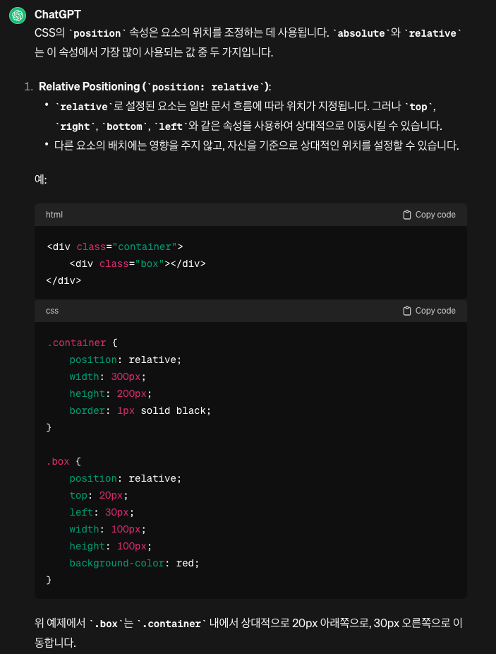
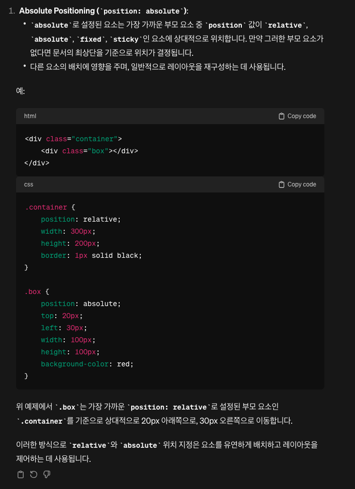
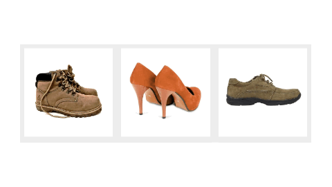

# html, css

## html

 markup language: 자료구조를 표현하는 언어. 브라우저를 통해 화면에 보여줄 자료의 구조를 표현한다.

## tag

대부분의 태그는 style 속성을 갖는다.

- img
- a
  - href="#"
- button
- p
- ol, ul
- span
- div, nav, section, footer

## 중간 정렬

```
style="
display: block;
margin-left: auto;
margin-right: auto;
"
```

## 폰트

- font-size
- font-family
- letter-spacing
- font-weight
  
## selector

이름을 짓고 style을 지정할 수 있다.

- class
- id
- tag

### 참고

- tag[속성명: 속성값]으로 속성을 특정할 수 있다.
- 쉼표로 여러 셀렉터에 같은 스타일을 적용할 수 있다.

```
a[href="https://www.example.com"] {
    /* 스타일 정의 */
}
```

### 자식 태그

- .content li
  - 위 처럼 class 이름과 태그명과 공백을 두면, content 클래스의 모든 li 자식에게 style을 부여한다.
- .content>li
  - 위 처럼 오른쪽 화살표로 지정하면, 직계 자손 li에만 적용된다.
  
## div

- 기본적으로 상, 하의 길이를 갖지 않는다.
- display: block을 내재한다.

## 레이아웃 만들기

- wrappe div로 감싸면서 순차적으로 만든다.
- float, inline-block으로 정렬할 수 있다.
  - float 사용 후에는 이후의 객체가 margin이나 정렬하면서 예상대로 처리가 되지 않으면 `clear: both`
 
## inline vs block

> inline 엘리먼트를 사용할 때 주의할 점은, width와 height 속성을 지정해도 무시된다는 것입니다. 왜냐하면 해당 태그가 마크업하고 있는 컨텐츠의 크기 만큼만 공간을 차지하도록 되어 있기 때문입니다. 또한, margin과 padding 속성은 좌우 간격만 반영이 되고, 상하 간격은 반영이 되지 않습니다.

### text

- 텍스트에는 baseline이 존재한다.
- inline-block으로 정렬하면 baseline 위에 객체가 정렬될 수 있으므로 주의한다.
- vertical-align: top으로 해결할 수 있다.
  - baseline은 영어 표기에 사용되는 줄과 같다.
  - baseline을 가지고 있는 텍스트와 inline-block이 같은 줄에 배치되면 baseline 위로 inline-block이 글자처럼 정렬되려하는 성질이 있다.

## p, h 등 텍스트

- 기본적으로 margin을 가지고 있어서 div 박스 안의 p, h 태그가 예상했던 부피보다 커질 수 있다.
- text-decoration: none 으로 a tag의 밑줄을 지울 수 있다.

## 백그라운드를 이미지로

- background-image: url();
  - 참고로 위 background-image와 같은 것을 css의 property(속성), img의 src, alt와 같은 것을 attribute(속성)이라고 한다.
- 이 때, 상대경로는 css 파일을 중심으로

### cover, contain

background-size의 값

- cover: 빈 공간없이 (div 공간만큼) 이미지로 가득 채워라
- contain: 이미지가 잘리지 않도록 한다.

## margin collapse 현상

- div 박스 2개의 위쪽 테두리가 겹쳐 있으면 margin 설정을 공유하는 일종의 버그
- 박스의 위 아래 테두리가 겹칠 때도 적용된다.
- 해결방안은 두 박스를 떨어뜨리는 것
  - 예를 들면 한 쪽 박스에 padding을 둔다.

## position과 좌표 레이아웃 만들기

- position 기준 설정
- float처럼 공중에 뜬다.

### position 종류

- relative: 원래 위치를 기준으로
- absolute: relative를 가진 부모 태그를 기준으로
  - 가운데 정렬: left right=0, margin: auto, width: 있기만 하면 된다.
- fixed: 화면을 기준으로

### relative



### absolute



### z-index

요소의 쌓임 순서를 결정한다. z-index가 높을 수록 앞에 있다.

## 반응형에 참고할 점

- 반응형 페이지를 만들기 위해서 width와 height에 %를 많이 사용하는데
- pc에서는 요소가 너무 커질 수 있다. 이럴 때, max-width와 min-width를 사용하면 좋다.
- width는 content 영역의 너비를 의미한다. 따라서 padding을 넣으면 max-width로 설정한 것보다 요소가 커진다.
  - box-sizing: border-box; 를 설정하면 width가 padding, border를 포함한다.

## vertical-align

- inline이나 inline-block의 세로 정렬에 사용된다.

## 부모 div가 자식 div를 포함하지 못할 때

- overflow: hidden;
  - 요소의 내용이 요소의 경계를 넘어갈 때, 잘리도록 설정
 
### 부모 div를 넘어가는 경우

- width가 content 영역을 기준으로 하기 때문에 100% 설정하면 padding 때문에 부모 block을 넘어갈 수 있다. border-sizing로 해결한다.
- position: absolute, position: fixed
- float: 요소를 부유(floating) 상태로 만들어 텍스트나 인라인 요소의 주위로 감싸질 수 있습니다.
- margin: 음수 마진은 벗어날 수 있다.
- overflow: 부모 요소의 내용이 자식 요소를 포함하지 않도록 하거나, 특정 방향으로만 스크롤되도록 할 수 있습니다.

## nth-child

- table에서 n번째 등장하는 요소만 스타일링할 때, 사용하는 셀럭터
  -  예, .table th:nth-child(2)

## pseudo class

요소와 커서의 상호작용으로 트리거, (a, button, 등)

 - hover: 커서를 올려두면
 - focus: 커서로 선택한 후
 - active: 커서로 누르고 있으면
 - a
   - link: 방문 전
   - visited: 방문 후 

참고로 위 hover, focus, active의 순서가 중요하다.

## class 작명할 때

Block__Element--Modifier 룰을 따라보자.

## 폰트에 관하여

```
@font-face {
    font-family: "건실한폰트";
    src: url(../font/NanumSquareR.woff);
}
```

- font-family로 이름을 지정할 수 있다.
- src에 css 파일을 기준으로 경로를 적는다.
- 여러 폰트를 지정할 수 있다.

```
@font-face {
    font-family: "건실한폰트";
    font-weight: 800;
    src: url(../font/NanumSquareB.woff);
}
```

- 위처럼 Bold 폰트를 따로 다운받고 위와 동일한 이름과 font-weight를 부여하면
- 다른 이름을 사용하지 않아도 굵으면서 bold에 적합한 폰트로 지정할 수 있다.

### woff ttf

- woff: 웹폰트용
- ttf: 운영체제 위에서 작동하도록 설계, 용량이 크다.

### IE 8 이하에서의 호환성

- Fallback font: 웹 폰트를 지원하지 않을 때, 대비할 수 있다.
- EOT, Embedded Open Type: 과거 버전에서 사용되는 포트 형식
- Conditional comments

```
<!--[if lte IE 8]>
<link rel="stylesheet" type="text/css" href="ie8-styles.css" />
<![endif]-->
```
```
@font-face { 
  font-family: 'NanumSquare'; 
  font-weight: 400; 
  src: url(NanumSquareR.eot); 
  src: url(NanumSquareR.eot?#iefix) format('embedded-opentype'), 
      url(NanumSquareR.woff) format('woff'), 
      url(NanumSquareR.ttf) format('truetype'); 
}
```

### font anti-aliasing

- macOS에서는 폰트를 뭐로 하든 이쁘게 보인다.
- 윈도우는 각져보이는(crispy) 현상이 생긴다.
  
해결

```
p, h4, h3,h2,h1, span {
  transform: rotate(0.04deg);
}
```

## display: flex

가운데 정렬하기

- width로 지정한 만큼 최대한 가지려고 한다.
- justify-content: 정렬할 수 있다.
- flex-direction: column -> 세로로 배치
- flex-wrap: wrap; 가로로 넘치면 다음 줄로 넘어가게 한다.
- flex-grow: 2 -> 다른 flex 요소대비 2 정도로 크기를 갖는다. 기본값은 없기 때문에 1이라도 있으면 다 차지하려고한다.
- align-items: center -> flex div 안의 요소를 가운데 정렬

## 반응형 레이아웃

### 미디어 쿼리

```css
@media screen and (max-width: 1200px) {
    .category {
        width: 50%;
    }
}
```

- 1200px 이하면 위의 스타일을 적용하라는 의미
- 미디어 쿼리는 최하단에 입력하여 위 property가 중복되어도 적용될 수 있게 한다.
- max-width와 같은 것을 breakpoint라고 한다.

### 자주 쓰는 breakpoint

- 태블릿
  - 1200px, 992px, 768px
- 모바일
  - 576px

## css debug

코드가 예상대로 작동하지 않을 때, 문제를 해결하는 과정이다.

### 크롬의 개발자 도구를 사용하여 디버깅하자

- 상단에 있는 화살표로 element를 클릭하거나 올려둔다.
- 밑에 적용된 Styles가 나오는데, 최상단의 위치한 property를 확인하여 문제를 해결한다.
  - 적용되지 않는 property는 취소선으로 보여준다.
- 개발자 도구에서 직접 수정하여 변화를 확인할 수 있으나 소스 코드는 변경되지 않는다.

## 애니메이션

 - 시작 스타일 만들기
 - 최종 스타일 만들기
 - 트리거 설정
 - transition

### 예제



- 이미지를 담는 box class, shop item 위에 가격을 띄울 수 있는 div.overlay 생성
- overlay는 position: absolute 부여하기 위해 relative div 생성
- 트리거(hover)를 설정하기 위해 overlay-wrapper를 overlay 위에 놓는다.
- overlay가 top: 100%를 갖으면서 relative div에 overflow: hidden는 넣는다.
  - 커서를 놓으면 등장하는 이미지가 사실은 밑에서 나오도록 한다.
- transition으로 style 변화 시에 점진적으로 표현될 수 있도록 설정

### 구현 코드

```html
<div class="shop-container">
  <div class="shop-item">
    <div style="position: relative; overflow: hidden;">
        <div class="overlay-wrapper">
          <div class="overlay">
            <p class="overlay-text">$50</p>
          </div>
          
        </div>
    </div>
  </div>
</div>
```

### 다른 사이트 애니메이션 훔치기

크롬 개발자 도구의 더보기에서 more tools -> Animations
